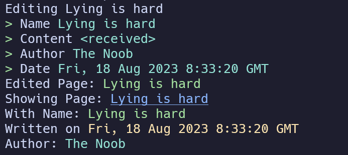

## Introduction

So, CMS is something that I always loved using. I just like the idea of having a service that controls your service.
I mean, it's like a service-ception. But, I always hated the idea of having a bloated admin panel.
I mean, why do you need a whole admin panel for a blog that you can manage with a CLI tool? 
You can if you want to, but then why not just integrate it with your blog?
If you do that, you would need to do so many things:

- Need to configure secure routes
- Add authentication
- Manage Access Control
- Basically a lot of things

So, I thought why not just write a CLI tool that handles all the stuff for you and since I had been learning Rust, I thought why not write it in Rust?
Hence, welcome the Noob Handler.

## Why Write in Rust?

I basically love CLI tools. They are a great and _easy_ way to get things done.
They are also so easy to ship. No need to check some weird windows compatibility or anything.
Just compile it and ship it. That's it. And, Rust is a great language for writing CLI tools.
It's fast, it's easy to write, and it's easy to ship.
You get an executable on the spot. Moreover, you get an executable that is fast and small in size.
No weird dependencies folder that needs to be shipped or anything.

### Why not python?

Python on the other hand, atleast in my opinion, has the worst executable experience.
To compile a python file, you might end up using a library like `pyinstaller` or something.
And, even then, you would end up with a huge executable. I mean, I don't want to ship a 100MB executable for a CLI tool.
That's just too much. Moreover, let's actually look at how pyinstaller works.

So, you see, pyinstaller works primarily by creating a virtual environment and then installing all the dependencies in that virtual environment.
Then, it creates all the necessary binding to _all_ the dependencies in cpython. And, then it creates an executable.
This executable is just for name sake. It's just a wrapper around the virtual environment.
So, when you run the executable, it just runs the virtual environment and then runs the python file.
This slows down the execution time and also increases the size of the executable.
That in the long run is not good for a CLI tool. That brings us to an important conclusion.

> Python is not meant to be compiled, it is meant to be interpreted.

Don't get me wrong, python has these cool libraries like `rich` that make writing CLI tools in python a breeze.
I have worked with `rich` in the past and it is one of my favorite libraries. However, it is best when 
it is used as a script. I use rich to style my scripts and it works great. But, when it comes to writing a CLI tool,
I would rather use a language that is meant to be compiled.

### Rust is awesome

So, welcome Rust.
Rust has a bunch of libraries that make writing CLI tools a breeze.
You have one for asking questions, one for styling, one for parsing arguments, and so on.
It is python with the speed of C and the safety of Haskell. What more can you ask for?
Actually scrap that. You can't really compare Rust with any other language.
It is it's own thing and it is great at what it does.

Here are some things that made me choose Rust:

- Great Type System
- Simple to use package manager
- Well documented libraries for CLI tools
- Single Binary executable
- Fast execution
- Good error handling
- Great community

If you feel that I just listed the most generic reasons to use Rust, you are right.
I mean, there is a reason why so many CLI's are written in Rust.
Infact, there is a whole community for rewriting `GNU/Linux` tools in Rust.
So, for example, you might have heard of `bat` which is a replacement for `cat`.
It has some cool features like syntax highlighting and stuff like that, you have `exa` which is a replacement for `ls` with some cool features like icons.
You basically have a sub community in rust that is interested in command line tools.

## What is a CMS?

Well, if you are unfamiliar with the term CMS, it stands for Content Management System.
So, the idea behind it is that instead of your content being changed at deployment time, it is changed at runtime.
Let me explain. So, let's say you use Astro to build your website. You have a bunch of markdown files that you use to generate your website.
Now, let's say you want to add a new blog post. You would have to add a new markdown file and then deploy your website.
This is the traditional way of doing things. However, with a CMS, you can just add a new blog post from the admin panel and it would be added to your website.
This is because your website will be reading off a remote database and not a local markdown file.

Now, my current blog is written using markdown files. I have a bunch of markdown files that are run through some remark plugins and then converted to HTML by Astro.
Nothing fancy. This is because my blog posts usually take a lot of time to write and I don't really write them that often.
Hence, when I do write them, I just add a markdown file and then deploy my website. It's not that big of a deal.

However, I have a page called `quips` where I write little updates about my life. I write them pretty often and I don't really want to deploy my website every time I write a new quip.
Hence, I use a MongoDB database to store my quips. I have a simple API that I use to add new quips and then I have a page that fetches all the quips from the database and displays them.
This is a CMS. I am managing my content from a remote database.

Along with quips, I have two other pages that use a database.
1. [NoobPaste Mini](/code): A simple and minimal pastebin that I use to share code snippets.
2. [NoobShort](/go): A simple URL shortener that I use to shorten URLs.

Both of these use a database to store their data. I have a simple API that I use to add new pastes and new URLs.
I actually have a NoobShort CLI that you can check out at [newtoallofthis123/short_cli](https://github.com/newtoallofthis123/short_cli).
It is quite easy to use and it is one of the first CLI's that I wrote in Rust.
You can just install it using `cargo install nshrt` and then you can use it to shorten URLs.

Anyways, getting back to the topic at hand, I have a bunch of pages that use a database to store their data.
All this is stored using a MongoDB database. I use MongoDB because it is easy to use and it is easy to setup.
So, MongoDB has a very easy to use rust driver called `mongodb`. It is well documented and it is easy to use.
I have used it in the past and I have had no issues with it. So, I decided to use it for my CMS.

## The Plan

The plan is simple. I want to write a CLI tool that can be used to manage my content.
I had to manage three types of content with the following B-JSON schemas:

```json title="BSON Schemas" frame="code"
// Quips
{
    "_id": "ObjectId",
    "hash": "String",
    "name": "String",
    "content": "String",
    "date": "String",
    "author": "String",
}

// Code
{
    "_id": "ObjectId",
    "hash": "String",
    "title": "String",
    "content": "String",
    "lang": "String",
    "author": "String",
}

// GO
{
    "_id": "ObjectId",
    "url": "String",
    "slug": "String",
}
```

So, the idea was that each of these had the following operations:
- Show
- Add
- Edit
- Delete
The __CRUD__ operations if you may. The CLI would have the following commands:

```bash title="CLI Commands" frame="terminal"
handler __doc__ __hash__

handler new __doc__

handler list __doc__
```

The __doc__ can be either `quips`, `code`, or `go`. The `__hash__` is the hash of the document that you want to edit or delete.

The list was basically show and search combined. It would show all the documents and then you could search for a specific document.
This could be done natively using the `inquire` crate, but more on that later.

### Summary of the Plan

So, let's summarize the plan:

- Connect to MongoDB
- Enable CRUD operations on the database
- Add a CLI interface to the CRUD operations
- Add New, Edit, and Delete operations
- Add a list operation
- Make everything as native and as fast as possible
- Make it look pretty

Let's take all these head on and see how we can implement them.

## Solving the Problems

First up was actually setting up the database. I already had a database with the given collections.
I just used the URI of it and connected to it using the `mongodb` crate. It was pretty easy to do.
It looks something like this:

```rust title="Connecting to MongoDB" frame="code"
async fn get_connection() -> Result<Client, mongodb::error::Error> {
    let client = Client::with_uri_str(get_mongo_url()).await?;
    Ok(client)
}
```

The `get_mongo_url` function just returns the URI of the database. I have it stored in an environment variable so that 
I don't have to hardcode it in the code. I just use the `dotenv` crate to load the environment variables.

Next up was actually enabling CRUD operations on the database. This was pretty easy to do as well.
So, the `mongodb` crate has a `Collection` struct that you can use to interact with the database.
I predefine the collections and then I just use the `Collection` struct to interact with the database.

```rust title="Defining the Collections" frame="code"
#[derive(Clone, Debug, Deserialize, Serialize)]
pub struct Page{
    pub _id: ObjectId,
    pub hash: String,
    pub name: String,
    pub content: String,
    pub date: String,
    pub author: String,
}
```

The collections use `serde` to automatically serialize and deserialize the data.
Next, I can use the inbuilt functions of the collections struct like `insert_one`, `find_one`, `find`, `delete_one`, and `update_one` to interact with the database.

```rust title="Getting a Page" frame="code"
pub async fn get_page(hash: &str)->Page{
    let collection = get_page_conn().await;
    let result = collection.find_one(doc! {"hash": hash}, None).await.unwrap();
    result.expect("Page Not Found")
}
```

So, that is one of the functions that I use to get a page from the database. I just use the `find_one` function to find a page with the given hash.
The `doc!` macro is very handy and is used to create a BSON document. It is basically a JSON object that is used to query the database.
If you are starting to see a pattern here, you are right. The mongodb driver for rust is basically an ORM for MongoDB.
One thing that I forgot to mention, all this set up with tokio and futures so that the whole execution is blocked till the database operation is complete.
This makes it easier to avoid type errors and stuff like that.

### CLI and Inquire

Next up was actually adding a CLI interface to the CRUD operations. This was pretty easy to do as well.
I use the `clap` crate to parse the arguments and then I use the `inquire` crate to ask questions.
The clap crate is pretty easy to use. You just define the arguments in a struct and then you use the clap macros to parse the arguments.
It looks something like this:

```rust title="Parsing Arguments" frame="code"
#[derive(Parser, Debug)]
#[command(name="Handler", author="Ishan Joshi", version, about="A Simple CLI to handle my site", long_about = None)]

// The Args struct is used to parse the command line arguments
struct Args {
    #[arg(required=true)]
    option: String,

    #[arg(required=false)]
    hash: Option<String>,
}
```

That's it! It is that simple. This comes with everything, the help command, the version command, and so on.
You can also add your own commands and subcommands. I just use the arg macro to define the arguments.
We get the arguments by calling the `Args::parse()` function. This returns a struct with the parsed arguments.

Although, I don't like to impose arguments on the user. I like to ask questions. So, I use the `inquire` crate to ask questions.
Inquire is a very useful crate that beautifully implements most of standard input and output operations.
So, you can ask for confirmation, ask for a password, ask for a list of options, and so on.
You can even have it open up a text editor for you to write your answer. It is a very useful crate.
So, I used it to write a custom function that takes in a instance of a struct and then asks questions based on the struct.
The quips struct looks something like this:

```rust title="Asking for input" frame="code"
pub fn ask_page(page: &Page)->Page{
    println!("{}", format!("Editing {}", page.name).as_str());
    let name = inquire::Text::new("Name").with_default(page.name.as_str()).prompt().unwrap();
    let content = inquire::Editor::new("Content").with_file_extension(".md").with_editor_command(std::ffi::OsStr::new("vim")).with_predefined_text(page.content.as_str()).prompt().unwrap();
    let author = inquire::Text::new("Author").with_default(page.author.as_str()).prompt().unwrap();
    let date = inquire::Text::new("Date").with_default(page.date.as_str()).prompt().unwrap();
    
    let page = Page{
        _id: page._id.clone(),
        hash: page.hash.clone(),
        name,
        content,
        author,
        date,
    };
    page
}
```
This would give an output like this



Which is pretty cool. I mean, it is a CLI tool, but it looks like a GUI. I love it.

I also had to implement a search function. I used the `inquire` crate for that as well.
I just used the `Select` struct to ask for a list of options and passed in the list of pages.
The inquire's `Select` struct is very powerful. It automatically asks the user to start typing and then it filters the list based on the input.
So, I just passed in the list of pages and then I got a list of pages that I could select from.
Searching was solved.

### Compiling

Next, all I had to do was integrate the whole thing together. I just had to call the functions in the right order.
It was quite easy and after a lot of debugging, I finally got it to work. Then, for the moment of truth, I ran `cargo build --release` and I got a single binary executable.
It was just 914kb in size! I now have a fully functional CMS that is just 914kb in size.

The best part? I don't need to carry or clone anything if I want to use it on another machine.
I only need to download the executable, which I will be hosting on my website, and then I can use it to manage my content.

## Conclusion

So, what can you take away from this? Well, you can take away the fact that you can write a CMS in Rust.
Rust is an awesome tool for writing CLI tools. It is fast, it is easy to use, and it is easy to ship.
After the whole thing, I only ended up writing about 600 lines of code. That is just amazing.

This was also a good learning experience for me. I learnt a lot about Rust, tokio and futures.
Overall, it was quite cool. So, for conclusion, should you write a CMS in Rust? Well, if you want to, go ahead.
However, sometimes, just sticking with a good web framework is the best option. I mean, you don't need to write a CMS for everything.
In my case, I had a very small use case and I wanted to write a CLI tool. Hence, I wrote a CMS in Rust.
However, I probably do recommend you writing a CLI CMS, since that teaches you a lot about the language and it's libraries, plus it is fun.

Anyways, I hope you enjoyed this post. I know this was a bit more technical than my other posts, but I hope you enjoyed it.
If you want to check out the code, you can check it out at [newtoallofthis123/noob_handler](https://github.com/newtoallofthis123/noob_handler).
You can even clone it, but you can't really use it since it is configured to work with my database.
Thanks for reading and I will see you in the next one. Bye!