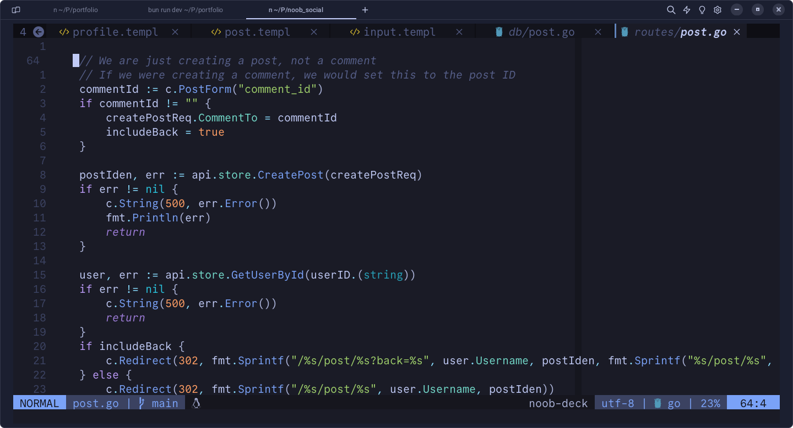

I am a tinker at heart. The methods and ways that I learn stuff are quite weird
at times and it shows in the way I use and personalize my development environment.
I use a Lenovo Ideapad laptop with about 10GB of Ram and an AMD processor. Windows 11
came in built with my laptop, although around 6 months ago, I finally made the 
long needed shift to Linux.

So my current setup is an [Ubuntu 24.04 LTS](https://ubuntu.com/blog/canonical-releases-ubuntu-24-04-noble-numbat) 
laptop, using the default Ubuntu-Gnome Desktop
environment. I sometimes end up using i3, however this is quite rare since wayland seems
to run way better on my laptop. For quite sometime after I made the shift to Linux, I 
used to use VSCode with Github Copilot for coding. I was always a terminal guy and after
some learning, I finally started using Neovim and wrote a small config setup for myself.

My [neovim setup](https://github.com/newtoallofthis123/nvim-config) is now quite 
a big repo and I use around 70 plugins (Well to be fair, most of them
are colorschemes). I am proud of it and don't plan on leaving it any soon.
In all this however, I stopped using AI for code completions completely.
I plan on writing a blog post on this soon. 
This made a huge impact on me.

I also landed on my favourite software on Linux.
1. Firefox / Brave: For web browsing
2. Calibre: For managing my pdf's
3. Warp: For my terminal
4. Thunderbird Mail: For my Email
5. [Apostrophe](https://flathub.org/apps/org.gnome.gitlab.somas.Apostrophe): For my markdown
6. Libreoffice: Office suite

This setup has been just perfect for me and I slowly trying to stick to it.
This is also partly because I want to work on my attention span and be more mindful and as
much as I like customization, I feel it has to do with my constant need for stimulation.

So there it is. I finally have a stable setup, that I can use for personal stuff and
work and school.
Kinda perfect, as it should be :)
