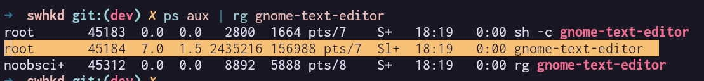
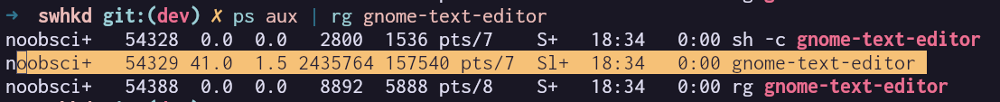

This might be one of the most important parts of the project and it involves launching a program in the userspace from a root process.
We are currently running our swhkd binary from the root space, either it be through pkexec or nice old sudo.
The problem here however is that we would want it to lauch programs from the userspace and not the root space.
This is because the userspace is where the user is, and we would want to run the program in the userspace to be able to interact with the user.

Hence solving this problem is something that I've been looking into from quite a while now and I think I finally
have something that works.

### A child thread

The first approach that I tried was to create a child thread and run the program in the userspace from there.
Now this should technically work, as the child thread should be running in the userspace.

However, for reasons that I am still figuring out, this approach did not work.
This is how the code for the child thread looked like:

```rust
std::thread::spawn(move || {
    perms::drop_privileges(user_id);
    let child = Command::new("sh")
        .arg("-c")
        .arg("gnome-text-editor")
        .spawn()
        .expect("Failed to execute command");
    println!("Child PID: {}", child.id());
}).join().unwrap();
```

The `perms::drop_privileges(user_id)` function is a function that uses the `nix` crate to drop the privileges of the thread to the given user ID.
It works and I am sure there is no problem with it.

So now, when I run this code and I use `ps aux | grep gnome-text-editor` to check the user of the process, it still shows root.



This was quite disappointing, as I was sure that this would work.

-- TODO: Add a reason why --

### Forking

When I dug around a bit more, I found out that the `fork` syscall can be used to create a child process.
A child process unlike a thread runs in a different address space and hence should be able to run in the userspace.
So, with this hope, I used the `nix` crate to make the fork syscall which is unsafe (expectedly).

```rust
match unsafe { fork() } {
    Ok(ForkResult::Parent { child, .. }) => {
    }
    Ok(ForkResult::Child) => {
        if setuid(Uid::from_raw(user_id)).is_err() {
            eprintln!("Failed to set UID.");
            std::process::exit(1);
        }

        let handle = std::thread::spawn(move || {
            Command::new("sh").arg("-c").arg("gnome-text-editor").output().expect("Failed to execute command");
        });

        handle.join().unwrap();
    }
    Err(_) => {
        eprintln!("Fork failed.");
        std::process::exit(1);
    }
}
```

And now when I check the user of the process, it shows the user of the process as the user who ran the program.



Okay so that worked.
Well kinda.

There are so many weird quirks with this approach that I am still not done testing it.
However, it does look like a very good idea on paper at least.
